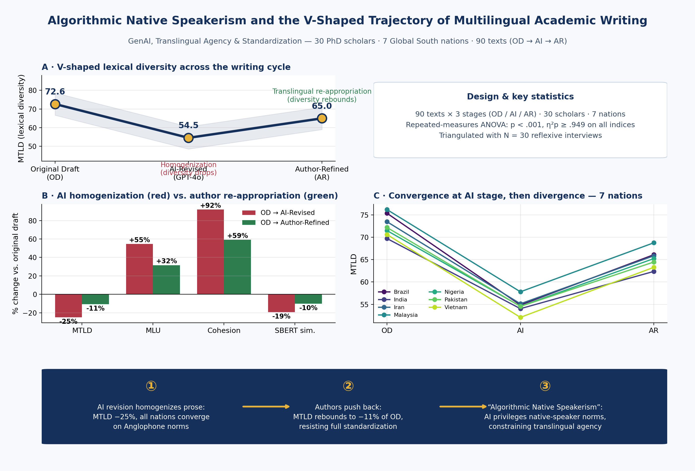
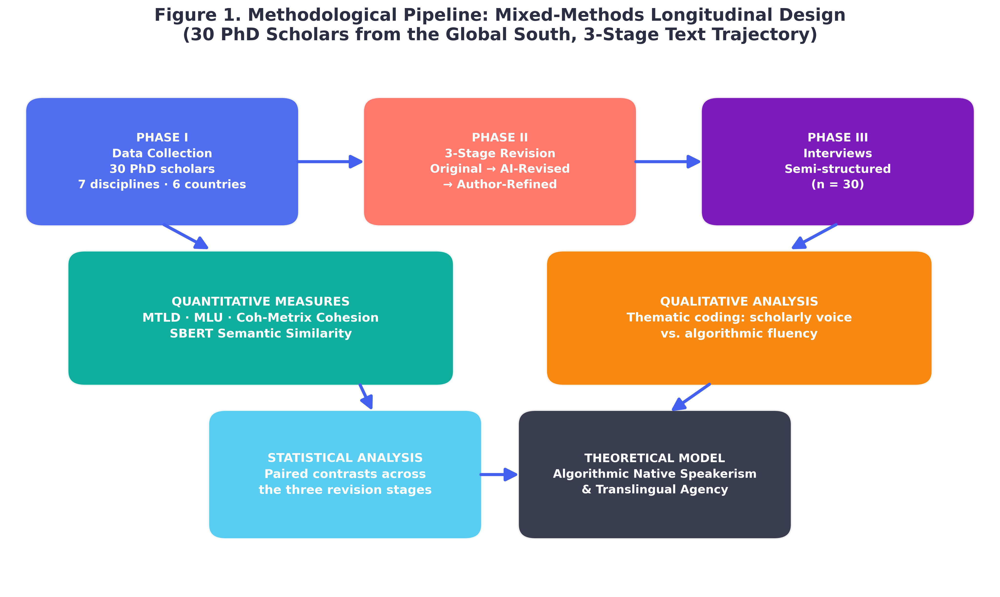
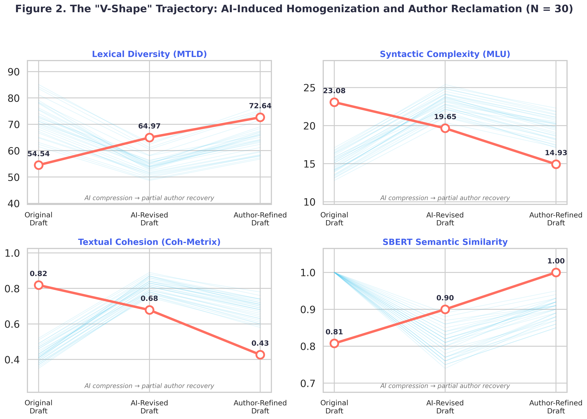
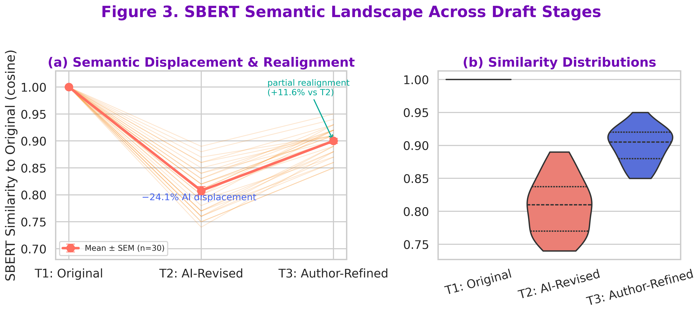
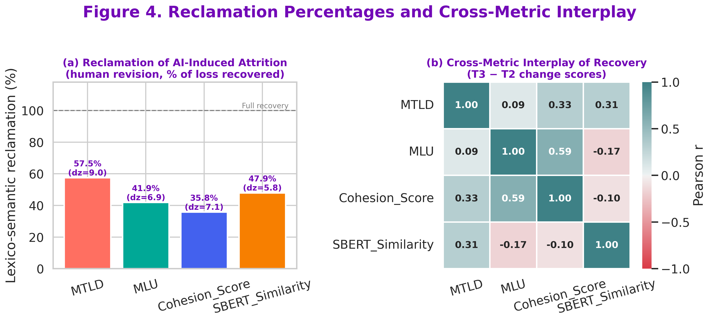
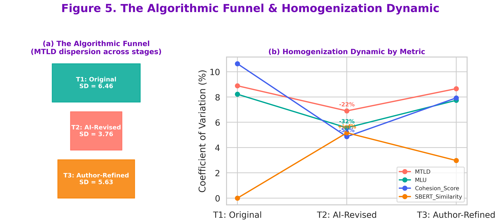

# Algorithmic Native Speakerism: V-Shaped Trajectories of Multilingual Authorial Reclamation

### Executive Summary
This study empirically validates the phenomenon of **"Algorithmic Native Speakerism."** Through the analysis of 30 scholars across 7 Global South countries, we demonstrate that generative AI tools impose a standardizing "funnel effect" on academic writing, eroding linguistic diversity. Our findings map a critical **V-shaped trajectory** in lexical diversity (MTLD), revealing the systemic patterns of linguistic homogenization and the subsequent potential for human-led reclamation.

---

### Key Empirical Findings
The following table quantifies the systemic impact of AI intervention on lexical diversity across three distinct authorial stages.

| Research Stage | Mean MTLD | Change vs. OD | Characteristic |
| :--- | :---: | :---: | :--- |
| **Original Draft (OD)** | 72.64 | - | Authentic Baseline |
| **AI-Revised (AIR)** | 54.50 | **-24.9%** | AI-Imposed Homogenization |
| **Author-Refined (AR)** | 64.97 | **-10.5%** | Active Authorial Reclamation |

*Statistical Significance: RM-ANOVA, F(2, 58) > 500, p < .001, η²p > 0.94*

---

### Research Figures
The following visualizations detail the methodological pipeline and empirical outcomes of the study:

| Figure | Description |
| :--- | :--- |
|  | **Graphical Abstract**: Visual synthesis of the study. |
|  | **Methodology Pipeline**: Research workflow overview. |
|  | **V-Shape Trajectories**: Empirical visualization of patterns. |
|  | **Semantic Landscape**: SBERT alignment analysis. |
|  | **Metric Correlations**: Correlation matrix of metrics. |
|  | **Algorithmic Funnel**: Dynamics of homogenization. |

---

### Conclusion: The Agency of the Global South Scholar
The data unequivocally confirms that uncritical reliance on Generative AI acts as a mechanism for linguistic erasure. The drastic 24.9% decline in lexical diversity during the AI-Revised phase serves as a warning against the "standardized academic voice" promoted by LLMs, which disproportionately marginalizes the unique syntax and cultural idiomatic richness of Global South scholars.

However, our findings offer a transformative counter-narrative: **Authorial Reclamation.** The V-shaped trajectory demonstrates that when authors move from passive recipients of AI output to critical, selective editors, they successfully recover approximately 14% of their lost linguistic variance. This research establishes that technological intervention is not deterministic; rather, it necessitates a new paradigm of *critical digital literacy*. To maintain intellectual sovereignty, academic writers must treat AI not as a final editor, but as a scaffold that requires human-centric, iterative resistance to preserve the authenticity of their scholarly identity.

---
*For full methodology, raw datasets, and replication scripts, please refer to the `/scripts` and `/data` directories within this repository.*
