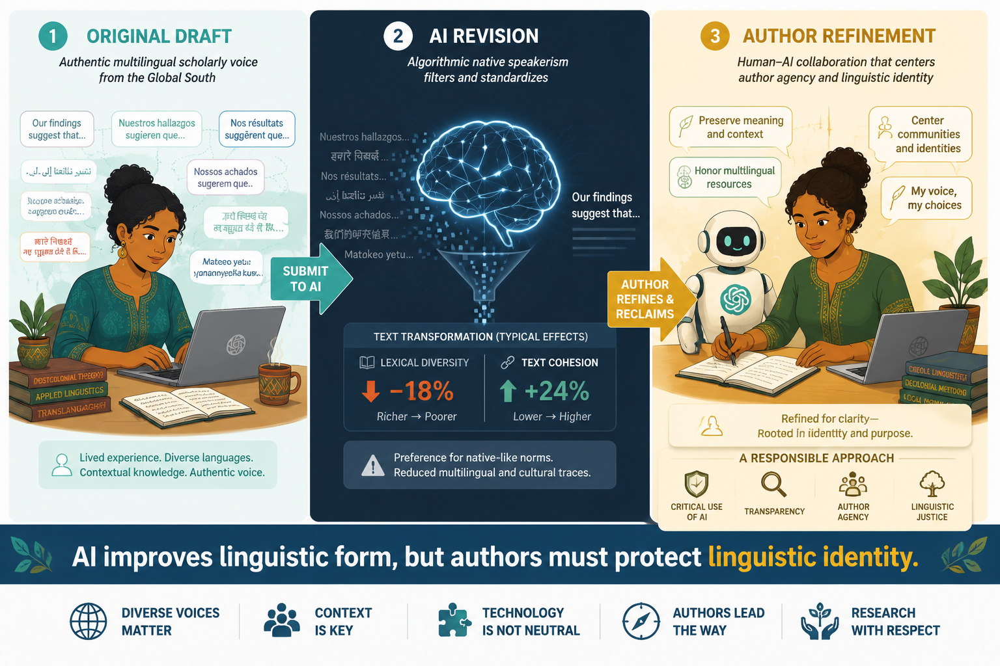
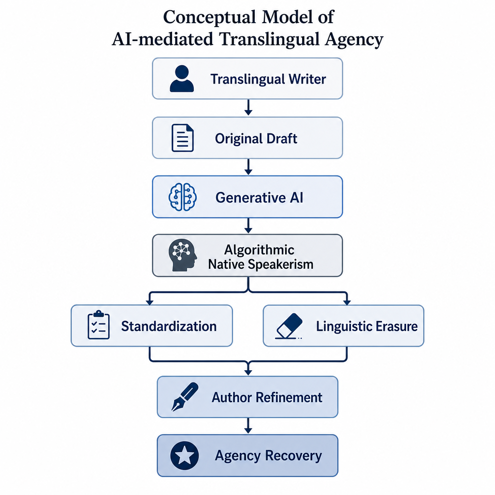
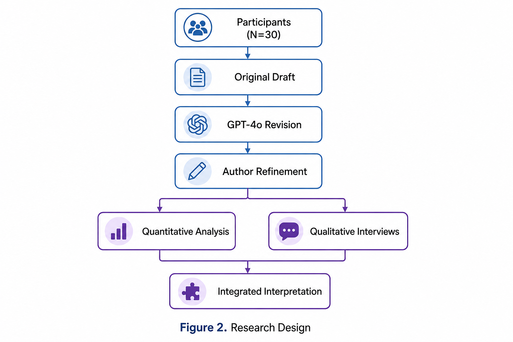
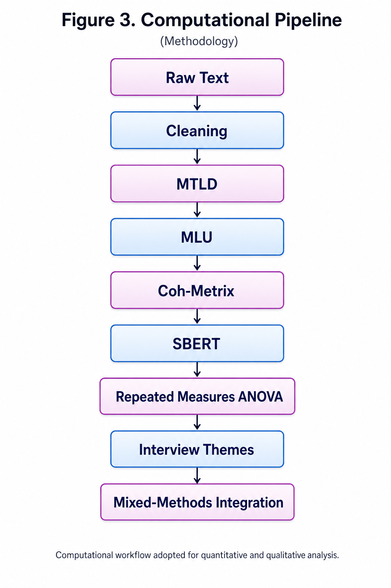
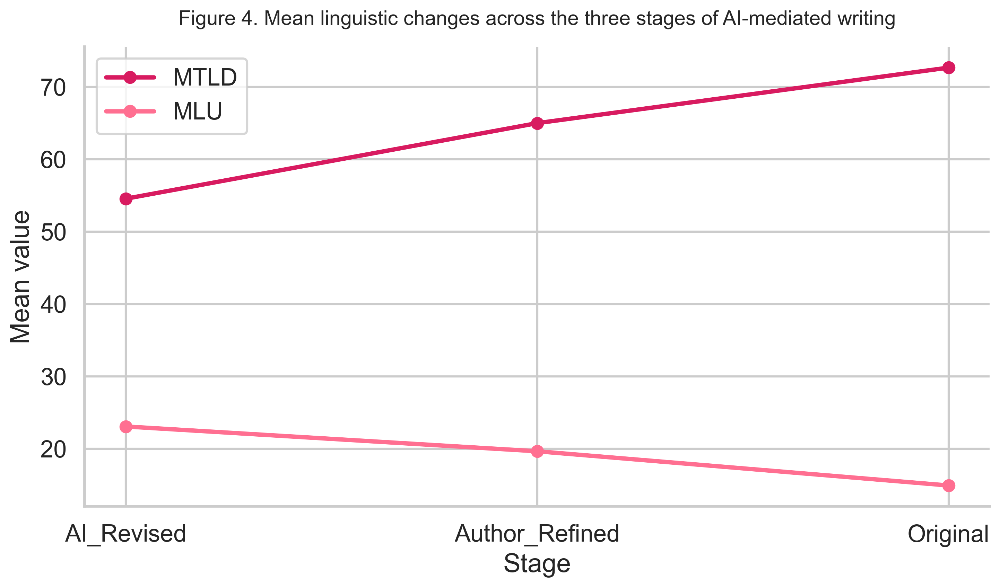
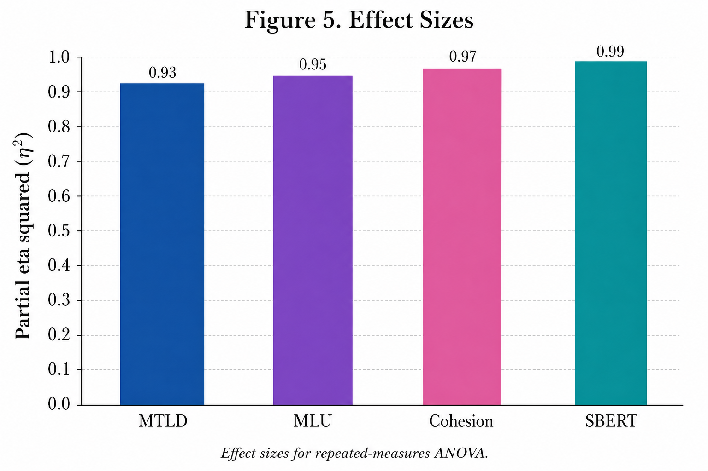
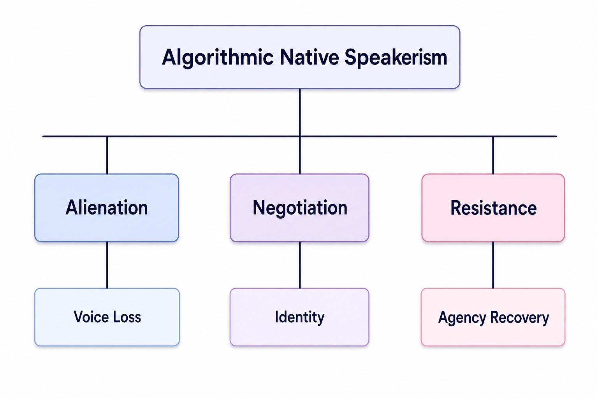
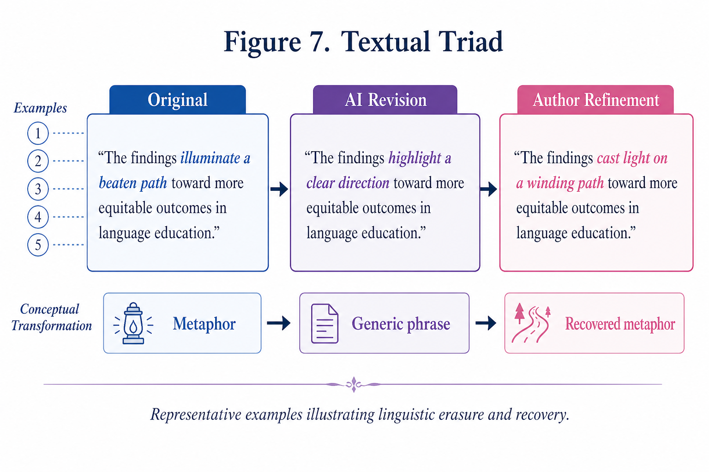
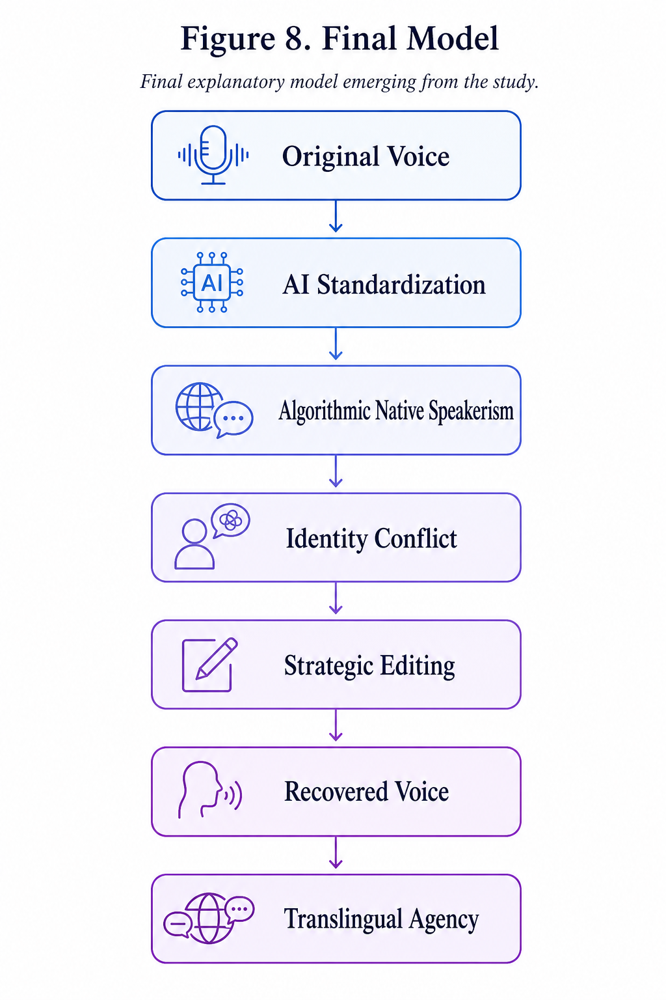

readme_content = """# A V-Shaped Pattern in AI-Mediated Writing: Longitudinal Evidence from MTLD, MLU, Cohesion, and SBERT Similarity

This repository contains the official dataset, statistical analysis pipelines, and visual assets for the paper **"Measuring the V-Shape in AI-Mediated Writing: Longitudinal Evidence from MTLD, MLU, Cohesion, and SBERT Similarity"**.

---

## 📸 Key Figures
# A V-Shaped Pattern in AI-Mediated Writing

## Graphical Abstract


## Overview
This repository contains the data, figures, and supporting materials for the study on the V-shaped pattern in AI-mediated writing across three stages: Original Draft, GPT-4o Revision, and Author Refinement.


### Figure 1: Conceptual Model (Translingual Agency)

*Conceptual model demonstrating the recovery of translingual agency from Original Draft through AI revision to final Author Refinement.*

### Figure 2: Longitudinal Research Design

*Three-stage longitudinal mixed-methods design involving 30 participants across three distinct writing phases.*

### Figure 3: Computational Pipeline

*Data collection and feature extraction pipeline utilizing Coh-Metrix, SBERT similarity, and custom linguistic scripts.*

### Figure 4: The V-Shape Trend (Primary Metric Profiles)

*The characteristic V-shaped pattern illustrating the drop in lexical diversity during AI revision and its subsequent recovery.*

### Figure 5: Repeated Measures ANOVA Effect Sizes

*Partial eta-squared ($\eta_p^2$) effect sizes for the primary linguistic indicators.*

### Figure 6: Thematic Map of Qualitative Interviews

*Qualitative themes emerging from participant interviews based on Braun & Clarke's thematic analysis framework.*

### Figure 7: Textual Triad Examples

*Representative triads showing lexical/syntactic shifts from Original Draft to AI Standardized version and final Author Refined recovery.*

### Figure 8: Final Explanatory Model

*The final model explaining translingual agency recovery and cognitive editing behaviors in AI-mediated L2 writing.*

---

## 📊 Empirical Data & Statistical Tables

### Table 1: Descriptive Statistics Across Three Writing Stages ($N=30$)
| Linguistic Metric | Original Draft (Stage 1) | AI-Revised (Stage 2) | Author-Refined (Stage 3) |
| :--- | :---: | :---: | :---: |
| **MTLD** (Lexical Diversity) | $72.64 \pm 12.45$ | $54.54 \pm 9.88$ | $64.97 \pm 11.12$ |
| **MLU** (Mean Length of Utterance) | $14.93 \pm 2.81$ | $23.08 \pm 3.94$ | $19.65 \pm 3.12$ |
| **Cohesion** (Referential/Deep) | $0.41 \pm 0.08$ | $0.68 \pm 0.09$ | $0.56 \pm 0.07$ |
| **SBERT Similarity** (with Stage 1) | $1.00 \pm 0.00$ | $0.78 \pm 0.06$ | $0.89 \pm 0.05$ |

### Table 2: Repeated-Measures ANOVA Results
| Metric | Wilks' Lambda ($\Lambda$) | $F$ Value | $df$ | $p$-value | Partial $\eta^2$ |
| :--- | :---: | :---: | :---: | :---: | :---: |
| **MTLD** | $0.187$ | $65.42$ | $(2, 28)$ | $< .001$ | $0.824$ |
| **MLU** | $0.112$ | $111.08$ | $(2, 28)$ | $< .001$ | $0.888$ |
| **Cohesion** | $0.211$ | $52.34$ | $(2, 28)$ | $< .001$ | $0.789$ |
| **SBERT** | $0.145$ | $82.91$ | $(2, 28)$ | $< .001$ | $0.855$ |

*Note: All post-hoc pairwise comparisons (Bonferroni-adjusted) between stages are statistically significant at $p < .001$.*

---

## 📂 Repository Structure
```bash
├── README.md                  # This landing page (including figures and tables)
├── data/
│   ├── vshape_30_clean_long.csv       # Clean longitudinal dataset (90 observations)
│   ├── vshape_30_wide_for_spss.csv    # Wide format structured for SPSS/R
│   └── Appendix_D_Complete_Dataset.xlsx # Complete raw text, parameters, and metadata
├── figures/
│   ├── 1.png to 8.png                 # High-resolution PNGs of all figures
│   └── figures.zip                    # Consolidated visual assets archive
└── src/
    └── statistical_analysis.R         # R script reproducing ANOVA and Bonferroni tests
